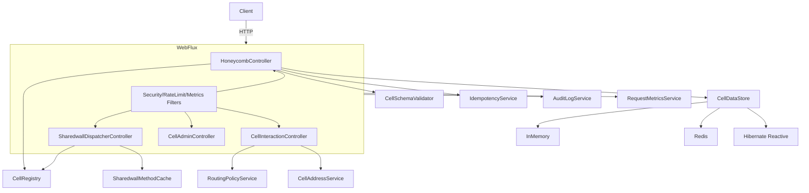

# Honeycomb Architecture and Integration Guide

This document explains how Honeycomb works, its core components, request flow, integration guidance, and enterprise use cases.

## 1) What Honeycomb is
Honeycomb is a Spring Boot WebFlux framework for **cells**—lightweight model or service components discovered at runtime and exposed through uniform CRUD, shared method invocation, and optional per-cell servers. It adds routing policies, API-key security, rate limiting, audit logging, metrics, and autoscaling.

Key ideas:
- **Cells** are units of functionality that can be discovered and addressed consistently.
- **Shared methods** allow cross-cell invocation via a single dispatcher.
- **Routing policies** select targets when multiple cell instances exist.
- **Observability** is built in: metrics, audit log, and WebSocket events.

## 2) Core components

### Web layer (controllers + filters)
- `HoneycombController`: Lists models, describes cells, and provides CRUD endpoints (for non-service cells).
- `SharedwallDispatcherController`: Dispatches `@Sharedwall` methods across cells.
- `CellInteractionController`: Forwards or invokes shared methods across cell instances.
- `CellAdminController`: Controls per-cell servers (start/stop/restart) and provides status.
- `RequestMetricsFilter`, `RateLimitFilter`, `ApiKeyAuthFilter`: Observability and security.

### Registry and routing
- `CellRegistry`: Discovers `@Cell` types and provides metadata.
- `ServiceCellRegistry`: Maps `@MethodType` methods (class or interface level) for service-style cells.
- `RoutingPolicyService`: Chooses targets when multiple cell addresses exist.

### Storage and validation
- `CellDataStore` and implementations (in-memory, Redis, Hibernate Reactive) abstract storage.
- `CellSchemaValidator` + JSON Schema provide optional validation.
- Idempotency components ensure safe retries for create/update.

### Shared methods
- `@Sharedwall` can be on **interfaces** or **methods**:
  - Interface-level `@Sharedwall` => all methods shared.
  - Method-level `@Sharedwall` => only those methods shared.
- Shared method invocation is exposed at `/honeycomb/shared/{methodName}`.

## 3) How a request flows

### Example: CRUD (model-style cell)
1. Client calls `/honeycomb/models/{cell}/items`.
2. `HoneycombController` validates operation and delegates to `CellDataStore`.
3. Optional schema validation and idempotency checks happen.
4. Audit and metrics are recorded.

### Example: Shared method invocation
1. Client calls `/honeycomb/shared/{methodName}` with `X-From-Cell` and JSON body.
2. `SharedwallDispatcherController` uses cached shared method mappings.
3. Dispatcher invokes candidates and aggregates results.
4. Audit and metrics are recorded.

## 4) Implementation diagram



## 5) Service-style cells (interface method exposure)

Honeycomb supports **service-style cells** where you expose only selected methods via `@MethodType`. This is ideal when the service layer owns all persistence and business logic.

- Annotate the service class with `@Cell`.
- Put `@MethodType` on methods or on an implemented interface.

Example:

```java
public interface CatalogServiceApi {
  @MethodType(MethodOp.READ)
  List<Map<String,Object>> listItems();

  @MethodType(MethodOp.CREATE)
  Map<String,Object> createItem(Map<String,Object> body);
}

@Cell("CatalogService")
public class CatalogServiceCell implements CatalogServiceApi {
  public List<Map<String,Object>> listItems() { ... }
  public Map<String,Object> createItem(Map<String,Object> body) { ... }
}
```

Routes:
- `/honeycomb/service/{cell}/{method}`
- `/honeycomb/service/{cell}/{method}/{id}` (optional path id)

## 6) Integration into a project

### Minimal integration steps
1. Add Honeycomb as a dependency.
2. Annotate your cell classes with `@Cell`.
3. (Optional) Add `@Sharedwall` methods or interface-level `@Sharedwall`.
4. Configure storage (in-memory/Redis/Hibernate) and security.
5. Add per-cell ports if you want dedicated servers.

### Example configuration
```yaml
honeycomb:
  security:
    api-keys:
      enabled: true
      header: "X-API-Key"
      keys:
        admin: "admin-key"
      per-cell:
        "*": ["admin-key"]
  routing:
    default-policy: "round-robin"
  rate-limiter:
    enabled: true
```

### Deployment patterns
- **Single instance**: all cells in one service.
- **Multi-instance**: multiple Honeycomb instances + routing policy (round‑robin, weighted).
- **Per‑cell servers**: isolate cell ports for scaling and traffic control.
- **Service discovery**: use Eureka or static addresses.

## 7) Advantages

- **Uniform API surface**: consistent CRUD and shared method patterns.
- **Dynamic discovery**: new cells are registered automatically.
- **Extensible routing**: policy-driven target selection.
- **Operational visibility**: metrics, audit logs, WebSocket events.
- **Security built-in**: API keys, optional OAuth2, mTLS.
- **Resilience**: rate limiting and circuit breakers.

## 8) Enterprise use cases

- **Microservice consolidation**: expose multiple domain services under one consistent gateway.
- **Multi-tenant platforms**: per-cell routing and policy enforcement.
- **Shared services**: shared methods for cross-domain operations.
- **Compliance/audit**: built-in audit logging and structured metrics.
- **Internal developer platforms**: standardized CRUD and shared invocation.

## 9) Operational considerations

- **Cardinality controls**: avoid high-cardinality metrics tags for scale.
- **Caching**: shared method discovery is cached to reduce overhead.
- **Scaling**: configure autoscale thresholds per cell.
- **Security**: enforce API keys and/or JWT for `/honeycomb/**`.

## 10) Next steps

- Expand schemas for each cell and enable validation.
- Adopt routing policies for consistent load distribution.
- Add CI benchmarks (JMH) for hot paths.
- Integrate with centralized logging and metrics dashboards.

## 11) How Honeycomb fits within a microservice architecture

Honeycomb typically sits **inside** a broader microservice landscape as a **domain-focused runtime** for multiple related cells. Common placements include:

- **Domain service hub**: A single Honeycomb instance aggregates multiple “cells” within a bounded context (e.g., Catalog, Pricing, Inventory). It reduces cross-service chatter and standardizes APIs.
- **Behind an API gateway**: Gateways handle external auth and routing, while Honeycomb provides consistent CRUD/shared endpoints for internal services.
- **Service mesh participant**: Honeycomb runs as a standard mesh service; discovery and routing policies select cell instances inside the mesh.
- **Internal platform layer**: Teams publish cells quickly while platform concerns (security, audit, metrics, routing) are enforced consistently.

**Integration benefits in microservices**:
- Consistent API surface across multiple domain components.
- Controlled inter-service invocation via shared methods and routing policies.
- Centralized observability for a domain (metrics, audit logs, events).
- Pluggable storage and validation with schema enforcement.
- Optional per‑cell servers for isolation and scaling.
